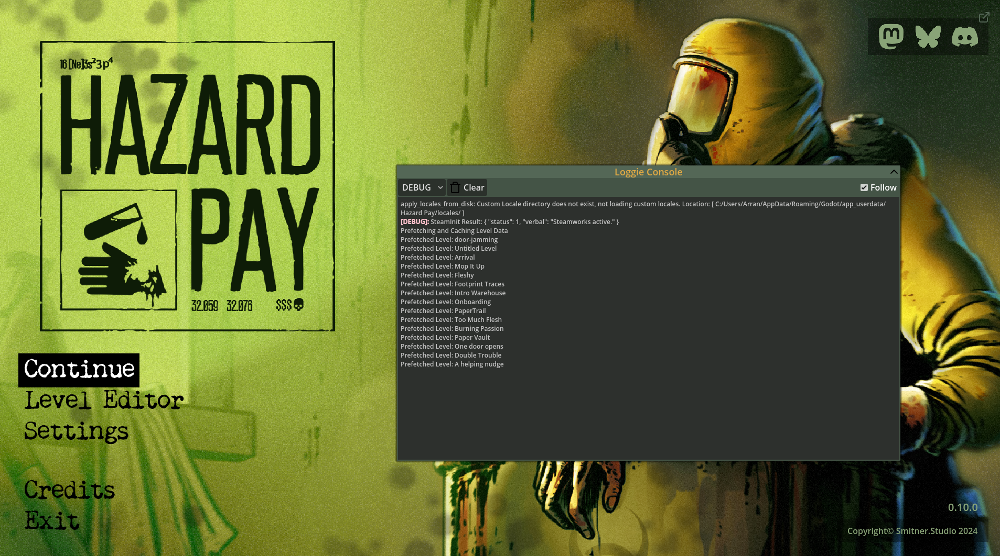

# Loggie Console
An interactive console for Godot, built upon [Loggie](https://github.com/Shiva-Shadowsong/loggie) 

## Install

1. Put the contents of `./addons` into your Godot project
2. Do one of the following:
   - Create an autoload of the Console scene `res://addons/loggie-console/scenes/console.tscn`.
   - Instantiate the `res://addons/loggie-console/scenes/console.tscn` scene where appropriate.
