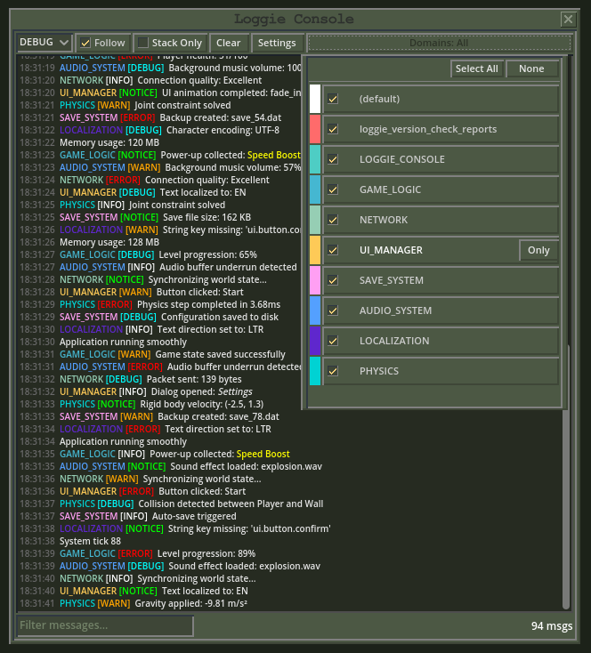

# Loggie Console
An interactive console for Godot `4.4`. Built upon the wonderful [Loggie](https://github.com/Shiva-Shadowsong/loggie) logging addon.

## Install

1. Install [Loggie](https://github.com/Shiva-Shadowsong/loggie).
2. Implement [Loggie](https://github.com/Shiva-Shadowsong/loggie) into your project. (Read the [User Guide](https://github.com/Shiva-Shadowsong/loggie/blob/main/docs/USER_GUIDE.md))
3. Put the contents of this repository's `./addons` directory into your Godot project.
4. Do one of the following:
   - Create an autoload of the Console scene `res://addons/loggie-console/scenes/console.tscn`.
   - Instantiate the `res://addons/loggie-console/scenes/console.tscn` scene where appropriate.

## Warning

> Half-cooked repo. Documentation to follow soon :tm: 

## Example

